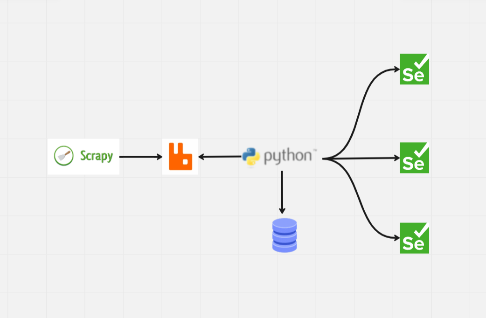

Схема состоит из нескольких частей:
1) https://scrapy.org/ фреймворк для сбора ссылок на скачивание
2) `scrapy` отправляет ссылки на скачивание в `rabbitmq`
3) к `rabbitmq` подключается консьюмер, который забирает данные, скачивает апк и записывает мета-информацию в БД

Порядок запуска

1) `docker-compose up -d` Поднимаем Rabbit и Postgres
2) `python runner.py`   Запуск scrapy
3) `python .\apk_downloader\main.py` Запуск консьюмера

p.s не забываем создать env и установить зависимости